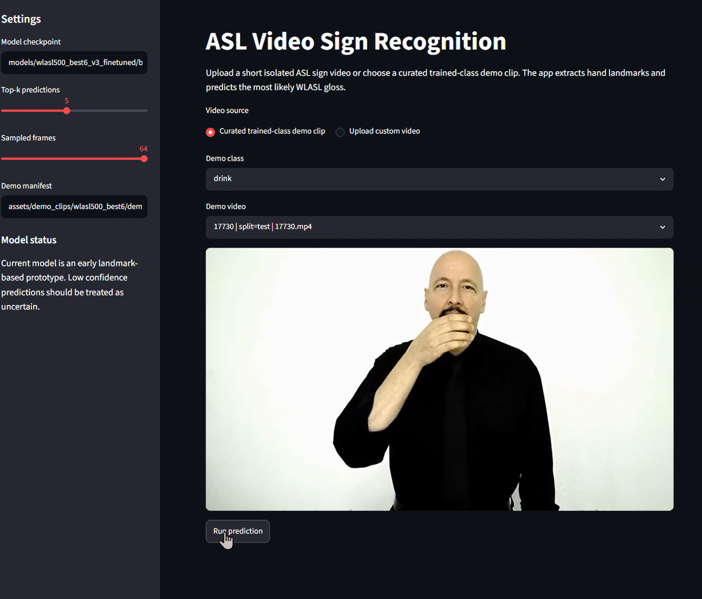
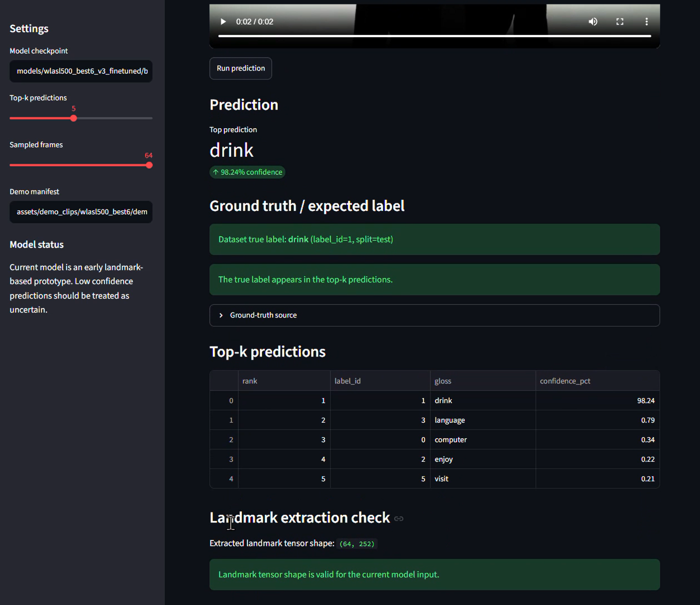

# ASL Video Sign Recognition

This repository contains an end-to-end prototype for isolated American Sign Language (ASL) video recognition. The system takes a short video clip, extracts MediaPipe hand landmarks across time, and uses a temporal neural model to predict the most likely WLASL gloss.

The final demo focuses on a quality-controlled 6-class model derived from a larger WLASL500 candidate pool. Earlier WLASL100, quality20, and WLASL500 experiments are preserved under `models/experiments/` and `results/experiments/` for transparency.

## Final Demo





Final demo classes:

```text
computer, drink, enjoy, language, sunday, visit
```

Final selected checkpoint:

```text
models/final/wlasl500_best6_v3_finetuned/best_model.pt
```

Curated demo clips:

```text
assets/demo_clips/final/wlasl500_best6/
```

## What Works

- Streamlit app for curated demo clips and custom video uploads.
- MediaPipe hand-landmark extraction from video.
- Top-k prediction output with confidence values.
- True-label comparison for curated/demo dataset clips.
- Reproducible WLASL subset creation, download verification, landmark extraction, quality analysis, and model training scripts.
- Final model separated from earlier experiments for easier review.

## Results Summary

| Experiment | Classes | Test Samples | Top-1 | Top-5 | Notes |
|---|---:|---:|---:|---:|---|
| WLASL100 baseline | 100 | 161 | 6.2% | 16.8% | Early full WLASL100 attempt |
| WLASL100 V2 transformer | 100 | 161 | 28.0% | 41.0% | Improved normalization/model pipeline |
| WLASL100 quality20 | 20 | 34 | 50.0% | 58.8% | Cleaner class subset from WLASL100 |
| WLASL500 best50 V3 | 50 | 59 | 28.8% | 47.5% | Broader WLASL500-derived benchmark |
| WLASL500 best6 V3 scratch | 6 | 6 | 33.3% | 83.3% | Trained from scratch |
| WLASL500 best6 V3 fine-tuned | 6 | 6 | 50.0% | 100.0% | Final selected demo checkpoint |

The final Streamlit demo can produce high-confidence correct predictions on curated trained-class clips, but the measured test set for the best6 model is very small. Results should be interpreted as a working prototype and not as a production ASL translator.

## Repository Structure

```text
app/                         Streamlit app
src/                         Flat source scripts for data, features, training, evaluation, prediction
scripts/                     Utility scripts for cleanup and demo asset creation
configs/                     Dataset and training configs
models/final/                Final selected model checkpoint
models/experiments/          Earlier model metadata and training histories
results/final/               Final selected model metrics, predictions, confusion matrix
results/experiments/         Earlier experiment outputs
assets/screenshots/final/    Final README/demo screenshots
assets/demo_clips/final/     Curated trained-class demo clips
data/processed/final/        Final lightweight manifest files
docs/                        Workflow, experiment, demo, and limitation notes
notebooks/                   Original static CNN assignment reference
```

## Setup

```powershell
py -m venv .venv
.\.venv\Scripts\Activate.ps1
py -m pip install --upgrade pip
py -m pip install -r requirements.txt
```

If MediaPipe install fails on Python 3.13, use Python 3.11 or 3.12.

## Run The App

```powershell
py -m streamlit run app/streamlit_app.py
```

Default app settings:

```text
Model checkpoint: models/final/wlasl500_best6_v3_finetuned/best_model.pt
Demo manifest: assets/demo_clips/final/wlasl500_best6/demo_manifest.csv
Sampled frames: 64
Top-k predictions: 5
```

Use **Curated trained-class demo clip** for the most reliable demonstration. Use **Upload custom video** for exploratory testing.

## Reproduce The Data Pipeline

The full WLASL raw videos and generated landmark arrays are not included in this clean package. To rebuild locally, place the official WLASL metadata at:

```text
data/raw/WLASL/WLASL_v0.3.json
```

Then follow the dataset workflow in:

```text
docs/DATASET_WORKFLOW.md
```

## Limitations

This project is intentionally presented as a prototype. Key limitations:

- Many WLASL classes have too few usable samples after download and landmark filtering.
- Some source videos are unavailable, private, expired, or corrupted.
- Some clips labelled as one gloss may contain extra motion, setup movement, repeated signs, or multiple signs.
- Some dataset labels are noisy or inconsistent.
- Video resolution, framing, signer position, background, and format vary significantly.
- Hand-only landmarks are not enough for all ASL signs; some signs require face, body, arm, or spatial context.
- MediaPipe can miss hands during fast motion, occlusion, low resolution, or poor framing.
- Several signs are visually similar, especially when represented only as hand keypoints.
- Confidence can be overconfident even when the prediction is wrong.

See:

```text
docs/LIMITATIONS.md
docs/MODEL_EXPERIMENTS.md
```

## Project Status

The repository demonstrates a complete working ASL video recognition pipeline:

```text
video -> frame sampling -> hand landmarks -> temporal model -> top-k prediction -> Streamlit demo
```

The strongest current value is the full engineering pipeline, model iteration process, quality filtering, and honest evaluation. Further accuracy improvements would likely require more usable labelled data, better video trimming, body/pose/face landmarks, and possibly pretrained video-language or sign-language models.

